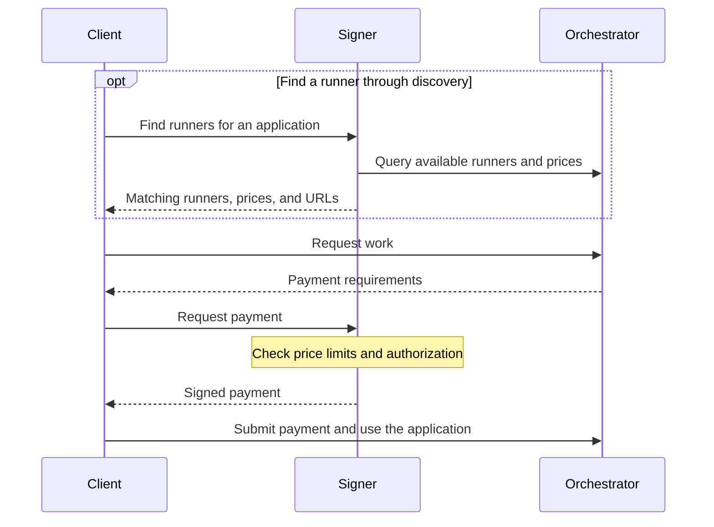

# Remote signer

The remote signer authorizes payments for work on the Livepeer network. It
holds an Ethereum key and signs payment tickets on behalf of clients, so an
application can pay for work without managing private keys or connecting to
Ethereum itself.

Running the signer as a separate service keeps keys out of the application and
media processing path. It also lets a payment operator manage funding, price
limits, and authorization independently of the applications using the network.
Clients can run in browsers, on mobile devices, or in backend services while
payment signing stays with the signer.

The signer can also provide **discovery**: finding orchestrators that offer the
application a client wants to run, along with their available runners and
prices. Runners execute the work; orchestrators make those runners available
to clients and collect payment.

At a high level, the client uses the signer to find work providers and arrange
payment, then sends its application requests to the chosen orchestrator:



## Run a signer

Copy the [configuration example](../configs/signer/config.example.toml) to
`/etc/livepeer/signer.toml` and configure:

- `KeyFile`: the file containing the Ethereum private key used to sign payments.
- `RPCURLFile`: the file containing the Ethereum RPC URL.
- `MaxHourlyPrice` and `MaxFixedPrice`: positive price limits in USD, described
  under [payment limits](#set-payment-limits).

The signer requires an on-chain connection. The Controller and ETH/USD feed
defaults are for Arbitrum mainnet; override them for another chain. See
[configuration and secrets](configuration.md) for key and credential formats.

Before making payments, fund the signer's account with both a TicketBroker
deposit and reserve using the [chain CLI](chain.md).

Start the signer:

```sh
bin/livepeer signer --config /etc/livepeer/signer.toml
```

Check readiness from another terminal:

```sh
curl -fsS http://127.0.0.1:8938/readyz
```

The signer API listens on `127.0.0.1:8937` by default; set `Listen` to change
that address. Keep it on a private network or behind an authenticated proxy,
and configure TLS termination at the proxy.

## Configure discovery

Discovery helps a client choose where to send work. A client can ask which
orchestrators have runners for a particular application or GPU, inspect their
advertised prices and capacity, and use a returned runner URL to start work.

Set `Orchestrators` to the base URLs to query. Local or private sources also
need [destination grants](configuration.md#destination-grants). For example:

```toml
Orchestrators = ["http://localhost:8935"]
DiscoveryGrants = ["http://127.0.0.1:8935"]
```

The signer queries each configured orchestrator's `/discovery` endpoint when
a client calls `GET /discover-orchestrators`. These configured URLs are its
discovery sources; it does not automatically build a list from the chain.

Query the signer to find runners:

```sh
# List all advertised runners
curl -fsS 'http://127.0.0.1:8937/discover-orchestrators'

# Find runners for an application
curl -fsS 'http://127.0.0.1:8937/discover-orchestrators?app=example'

# Also require a particular GPU name
curl -fsS 'http://127.0.0.1:8937/discover-orchestrators?app=example&gpu=H100'
```

Results include the orchestrator service URL and each matching runner's
application, URL, mode, capacity, GPU information when available, and advertised
price. Both filters must match when `app` and `gpu` are supplied together.

Discovery reports what the sources advertise. Price limits are checked when
the signer generates a payment, so an advertised runner may still exceed your
configured limit. Finding a runner also does not reserve its capacity; the
client must request a session or submit work at the returned URL. See the
[discovery reference](http-api.md#discovery-filters-and-results) for result
fields and filtering details.

## Connect a client

Configure the client with the signer's base URL, such as
`https://signer.example.com`, and the credentials required by your authenticated
proxy. Include that authentication on every request to the signer. The client
needs network access to both the signer and the orchestrator it will use.

The client can discover runners through the signer or use a known runner URL.
When the orchestrator requests payment, the client passes its payment
requirements to the signer and submits the resulting signed payment to the
orchestrator. Application traffic goes to the orchestrator; the signer handles
payment requests separately.

For a client integration, follow the [signer HTTP API](http-api.md#remote-signer-http)
for request and response formats. Clients must retain the signed payment state
returned by the signer and pass it unchanged on subsequent payment calls for
the same session. The [SDK integration fixtures](development.md#sdk-integration-fixtures)
document the client versions and flows tested with this node.

## Set payment limits

Price limits control how much the signer will agree to pay for work:

| Setting | Limit |
| --- | --- |
| `MaxHourlyPrice` | USD per hour for work billed by duration. |
| `MaxFixedPrice` | USD per request for work billed at a fixed price. |

The signer uses its ETH/USD feed to compare these limits with the orchestrator's
price. Clients and authorization webhooks can supply an additional `maxPrice`
in wei. Every applicable ceiling must be satisfied, and subsequent payments
cannot exceed the session's initial unit price. See the
[payment limit reference](http-api.md#payment-limits-and-refresh) for units and
exchange-rate behavior.

Use `MaxTicketEV`, `MaxBatchEV`, and `DepositMultiplier` to constrain ticket
exposure independently of the work price. These limits do not cap cumulative
spending. Enforce an overall budget through an authorization service or
clearinghouse that tracks spending and decides whether to approve each payment.
Clients hold the signed payment state, and earlier state can be reused;
retries can generate separate payments.

## Authorization

An optional authorization webhook lets your service decide who may spend from
the signer's account and under what conditions. For example, it can reject a
payment when a customer's budget is exhausted or apply a customer-specific
price ceiling.

Set `AuthWebhookFile` to a file containing the webhook URL. If the webhook
requires authentication, set `AuthWebhookHeadersFile` to a file containing
comma-separated headers such as `Authorization: Bearer credential`.
Omit the webhook settings to disable it.

The signer sends the webhook the original client headers and proposed payment
state. It returns payment credentials to the client only after approval. See
the [webhook reference](http-api.md#authorization-webhook) for request examples,
approval and rejection responses, and optional price ceilings.

Omit `expiry` or return zero to authorize every payment. A future Unix timestamp
caches approval and its price ceiling until expiry, delaying revocation and
budget checks. Signed state becomes a bearer credential during cached approval.
A proxy must authenticate requests and overwrite untrusted `Signer-` headers.
`Signer-Auth-Id` by itself does not authenticate a caller.

## Kafka accounting and budgets

The signer can publish signing events to Kafka so an accounting service can
track payments. For a clearinghouse that uses those events to enforce budgets,
configure Kafka together with the authorization webhook.

Add `[Kafka]` with a bootstrap broker and topic. Create the parent directory
for `OutboxDB` before starting; it stores events waiting for delivery:

```toml
[Kafka]
Broker = "kafkas://broker.example.com:9096"
Topic = "livepeer-signing"
UsernameFile = "/run/secrets/kafka-username"
PasswordFile = "/run/secrets/kafka-password"
OutboxDB = "/var/lib/livepeer/signer-events.sqlite"
```

Credentials enable SASL/SCRAM-SHA-512 by default. Set the broker's port explicitly
and choose `AuthMethod` to match its listener. Omit all Kafka settings to disable
accounting. Give each replica its own outbox.

Events are persisted before the payment response and delivered at least once;
consumers must deduplicate event IDs. Separate signing requests produce separate
events, including requests whose responses are interrupted. Accounting lag can
allow a budget to be exceeded before authorization stops further signing.

## Readiness and monitoring

Use the metrics listener (default `127.0.0.1:8938`) for `/healthz`, `/readyz`,
and `/metrics`.
Readiness checks chain access, sender funds, exchange-rate freshness, and enabled
outbox storage. Monitor pending events, oldest event age, publish errors, and
filesystem space. Kafka connectivity alone does not determine readiness.

Replicas with the same key and authorization configuration can continue
client-held signed state. Keep a separate durable outbox for each replica.

## Reference

- [HTTP API](http-api.md#remote-signer-http): endpoints, fields, discovery filters, and payment limits.
- [Authorization webhook](http-api.md#authorization-webhook): decision fields and failure behavior.
- [Accounting events](http-api.md#accounting-events): delivery limits and metrics.
- [Configuration example](../configs/signer/config.example.toml): settings, defaults, and Kafka options.
- [Payment recovery](payment-recovery.md#signer-accounting-recovery): backup, restart, and backlog handling.
